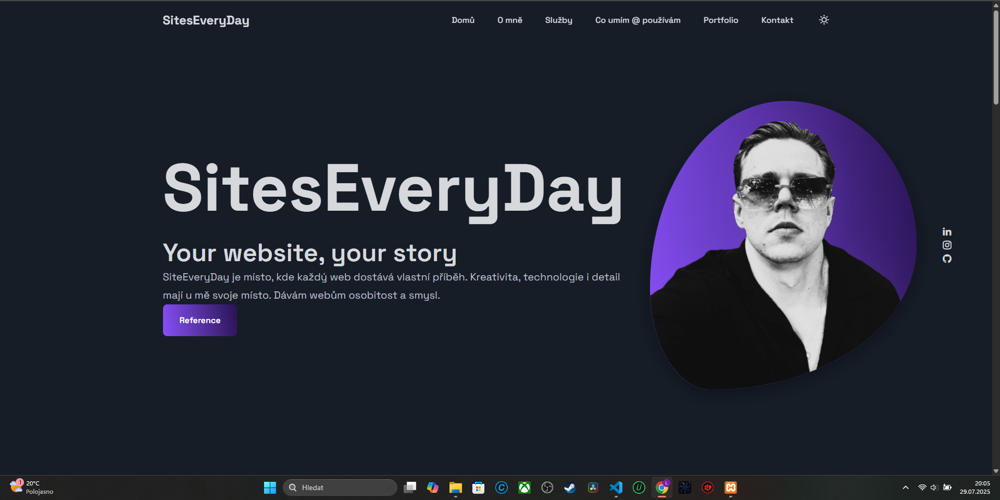
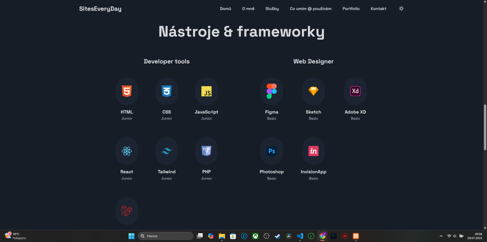
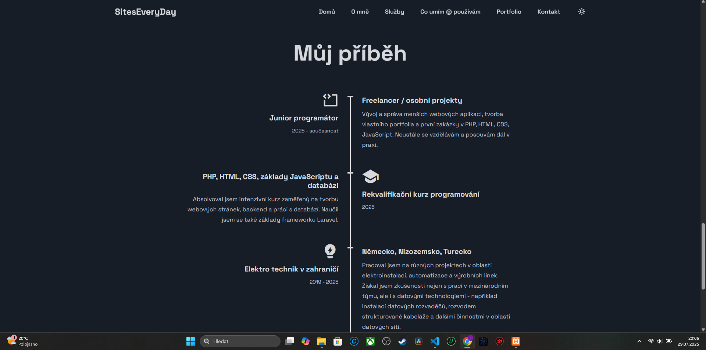
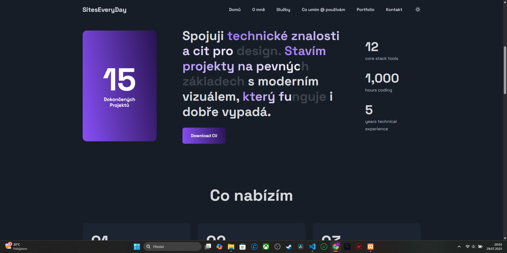

# 🚀 SitesEveryDay – moderní prezentační web

Tento web je moderní prezentační stránka vytvořená jako součást mého portfolia. Zaměřil jsem se na vizuální čistotu, responzivní layout a prezentaci vlastních dovedností v přehledné formě. Web je ve fázi vývoje, ale už nyní ukazuje směr, kterým se chci jako junior vývojář ubírat.

---

## 🧑‍💻 O projektu

🟣 **Cíl:** Ukázat nejen kód, ale i cit pro design, strukturu a práci s moderními UI prvky.  
🟣 **Stav:** Pracovní verze, statický frontend (zatím bez backendu)  
🟣 **Použité technologie:** HTML, CSS (Tailwind), JavaScript

---

## ✨ Funkce & Sekce
- ✅ Hero sekce se sloganem a CTA
- ✅ Nabídka služeb – grafické dlaždice
- ✅ Sekce „Co používám“ – frameworky a nástroje s ikonami
- ✅ Timeline s příběhem a zkušenostmi
- ✅ Sekce s čísly (projekty, zkušenosti, hodiny kódování)
- ✅ Moderní tmavý režim, čistý layout

---

## 🔧 Použité nástroje & frameworky

- **Frontend:** HTML5, CSS (Tailwind), JavaScript
- **Designové nástroje:** Figma, Photoshop, Adobe XD (základy)
- **Frameworky:** základy Laravel, React (UI struktura)
- **Styl:** moderní tmavý režim, přehledné bloky, vysoký kontrast

---

## 📸 Náhledy

### 🟣 Úvodní stránka

### 🟣 Nabídka služeb

### 🟣 Frameworky & nástroje

### 🟣 Můj příběh

### 🟣 Ukázka designového stylu

---

## 📝 Poznámka
Tento web slouží jako **prezentace mých aktuálních schopností a vizuálního přístupu k tvorbě webu**. Projekt není plně funkční (chybí backend), ale slouží jako ukázka designu, rozvržení a použitých frameworků.

---

## 👤 Autor
- Jméno: Lukáš Zvěřina
- Web: [www.SitesEveryDay.cz](https://www.siteseveryday.cz)
- GitHub: [github.com/Lukas33K](https://github.com/Lukas33K)
- E-mail: SitesEveryDays@gmail.com
